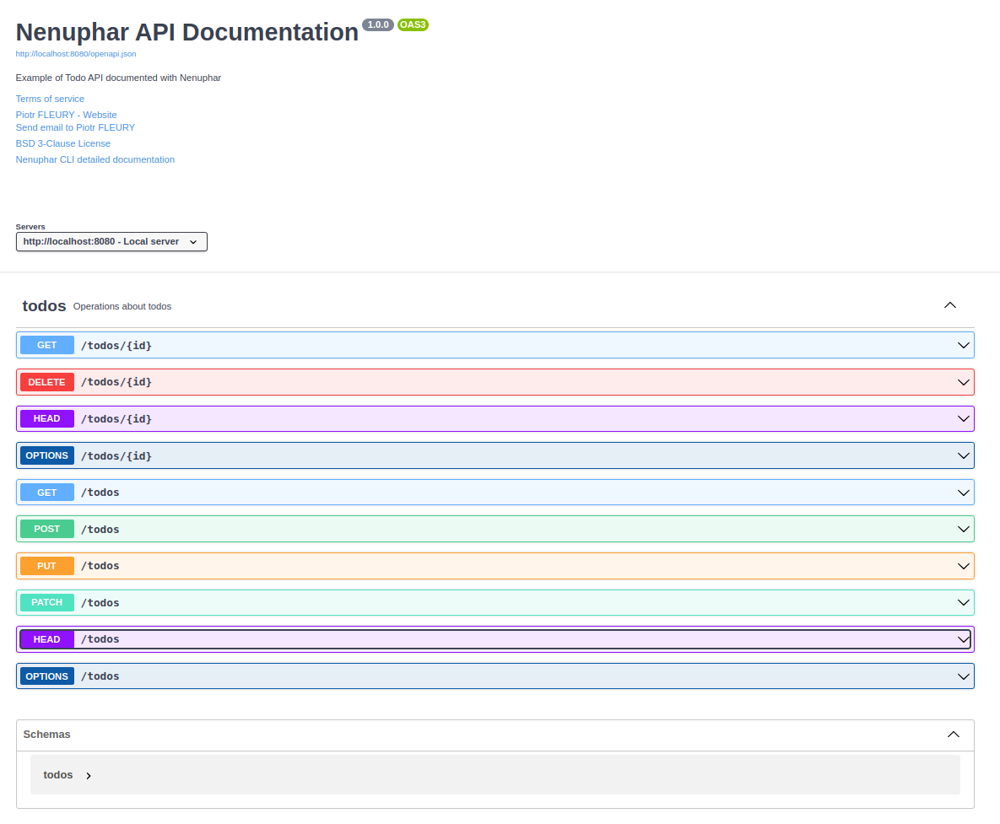

# Nenuphar - Your OpenAPI generator CLI


[![style: very good analysis][very_good_analysis_badge]][very_good_analysis_link]
[![License: MIT][license_badge]][license_link]

Nenuphar is a CLI application to generate Swagger UI OpenAPI definition files for your  [Dart Frog](https://dartfrog.vgv.dev/) Server. 

---

# Dart Frog


[Dart Frog](https://dartfrog.vgv.dev/) is a minimalistic backend framework for Dart.

## Create a new Dart Frog project

To create a new Dart Frog backend project, run the following command:

```sh
dart pub global activate dart_frog_cli
dart_frog create <project name>
```

# Nenuphar CLI

## Installation

```sh
dart pub global activate nenuphar_cli
```

## Initialize your project

First you need to initialize your project by running the following command in the root of your project:

```sh
nenuphar init
```

This will create new file `public/index.html`. This file will be served statically by your Dart Frog server to expose your `Swagger UI` documentation.

## Generate openapi definition file

Nenuphar scans your Dart Frog project to generate an OpenAPI definition file.
Each route will generate the CRUD operations documentation for the exposed resource.

First create a Dart Frog route:

```sh
dart_frog new route "/todos"
```

Then generate the OpenAPI definition file

```sh
nenuphar gen
```

The openapi specification will be written in the `public/openapi.json` file.
This file is loaded by the `public/index.html` file to display the documentation.

## Start your Dart Frog server

You're now ready to start your Dart Frog server

```sh
dart_frog dev
```

Visit [http://localhost:8080/index.html](http://localhost:8080/index.html) to see your documentation.

```sh
open http://localhost:8080/index.html
```

## Enjoy 🎉



__Thanks for using Nenuphar!__

# Detailed documentation

Please visit [https://piotrfleury.github.io/nenuphar_cli/](https://piotrfleury.github.io/nenuphar_cli/) for detailed documentation.

Generated by the [Very Good CLI][very_good_cli_link] 🤖

---

[license_badge]: https://img.shields.io/badge/license-bsd_3_clause-blue
[license_link]: https://opensource.org/licenses/bsd-3-clause
[very_good_analysis_badge]: https://img.shields.io/badge/style-very_good_analysis-B22C89.svg
[very_good_analysis_link]: https://pub.dev/packages/very_good_analysis
[very_good_cli_link]: https://github.com/VeryGoodOpenSource/very_good_cli